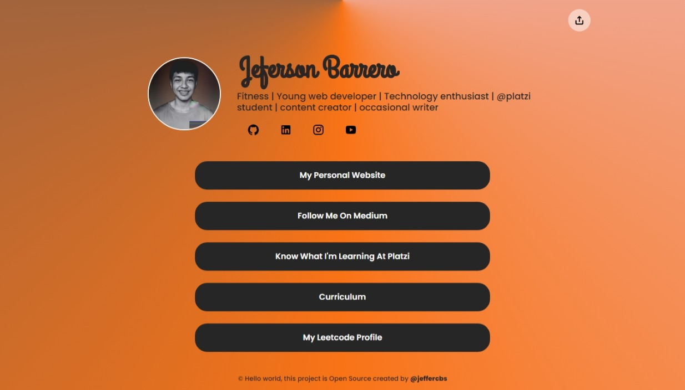

# Linktree con Vite y Svelte

Este proyecto tiene como objetivo crear un linktree, es decir, una página que contenga una lista de enlaces a redes sociales, portafolios o páginas web personales en una sola dirección URL.



# 🧰 Tecnologías utilizadas

-  **Vite** como bundler y servidor de desarrollo
-  **Svelte** como framework de JavaScript para la construcción de la interfaz de usuario

# 🔧 Configuración del proyecto

-  Clonar este repositorio
-  Instalar las dependencias mediante pnpm install
-  Iniciar el servidor de desarrollo mediante pnpm run dev
-  Acceder al navegador para ver la página

# 🍀 Estructura del proyecto

```
/
├── public/
│   └── icons/
│   └── ..
├── src/
|   ├── assets/
│   ├── components/
│   │   └── Icons/
|   |   └── ....
│   ├── lib/
│   ├── store/
│   └── App.svelte
└── package.json
```

# Contribución

Si deseas contribuir a este proyecto, puedes enviar un pull request con tus cambios. Se agradecerá mucho cualquier ayuda.

# Licencia

Este proyecto se distribuye bajo la licencia MIT. Consulta el archivo [LICENSE](https://github.com/jeffercbs/linktree/LICENSE) para más detalles.
